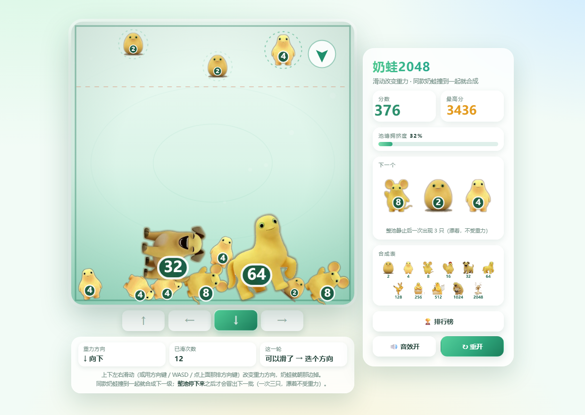
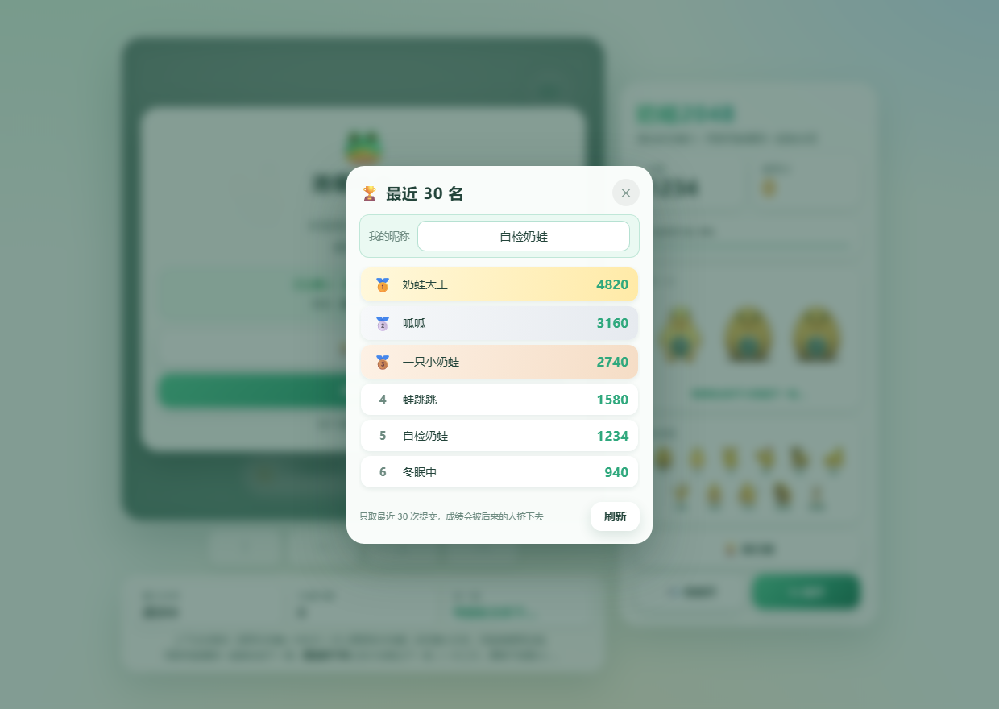

# 奶蛙2048

纯 **HTML + CSS + JavaScript** 的静态网页小游戏，零依赖、零构建、离线可玩，
玩法基于 [BigNaiWa](https://github.com/YHSome/BigNaiWa)（合成大奶娃）的样例改出来的：

> **在线玩**：<https://yhsome.github.io/Nai2048/>　（手机浏览器直接打开就能玩）

> **一群奶蛙漂在池塘里，它们不受重力影响。**
> 你往哪个方向滑，重力就变成哪个方向 —— 奶蛙哗啦啦往那边掉过去，
> **两只同级的奶蛙撞到一起就合成下一级**：`2 → 4 → 8 → … → 2048`。

**棋盘是正方形**（560×560）：四个方向的重力完全等价。
长方形的话「上下」有 680 高、「左右」只有 400 宽，往左右甩会明显更难 ——
方形之后往哪边甩都一样宽。奶蛙的整体尺寸另外放大了 30%（`SIZE_SCALE`），节奏明显快了不少：
一局大约 **70 秒 / 35~50 次滑动**（随机乱甩的机器人实测，会玩的人更久）。



## 🎮 玩法

| 操作 | 效果 |
| --- | --- |
| 向上滑 / `↑` / `W` | 重力朝上，奶蛙往天花板掉 |
| 向下滑 / `↓` / `S` | 重力朝下，奶蛙往地板掉 |
| 向左滑 / `←` / `A` | 重力朝左 |
| 向右滑 / `→` / `D` | 重力朝右 |
| `R` | 重开一局 |

> **一轮一次，必须等整池停下来。**
> 滑完之后奶蛙还在飞的时候再滑是**不算**的：重力方向不会变，中间会飘一句
> 「等奶蛙全停下…」/「等新奶蛙出现…」，罗盘变灰、外面套一圈虚线环，方向键也会变淡；
> 等奶蛙全停下、这一批新奶蛙也出来了，罗盘恢复成绿色箭头，才轮到下一轮选择。
> **棋盘下面那条状态栏**会同步写着「等奶蛙全停下…」/「可以滑了 → 选个方向」。
> （万一有奶蛙一直静不下来，最多 8 秒也会放行，绝不会卡死。）
>
> 也可以直接点**棋盘正下方那排方向键**（↑ ← ↓ →）来选方向，
> 不必依赖滑动手势 —— 有些手机浏览器会把斜滑/长滑当成前进后退之类的快捷手势。

- **开局没有重力**：8 只奶蛙随机漂在池子中间，就那么悬着（面板显示「漂浮中」，
  底部提示条也会写明「8 只奶蛙漂着（不受重力）」）。
  滑第一下，重力才生效 —— 这也是开局唯一的操作。
- **滑动不只改重力**：还会把所有奶蛙朝新方向**甩一下**（甩出去的初速度），
  所以哪怕它们已经堆成一座山，再滑一下也会重新翻动、有机会撞出合成。
- **出下一批的时机（一回合）**：滑一下 → 奶蛙朝新重力方向掉下去 →
  **这期间不能再滑**（滑了也不算，会提示「等奶蛙全停下…」）→
  **等整池都静止下来**（连续 0.25 秒速度都低于 36px/s）→ 才冒出下一批，**一次三只**。
  实测：新一批出现的那一刻，场上**一只在动的都没有**（40 次结算全部为 0），
  滑动到结算平均 1.7 秒。
  「下一个」那一格会把**这三只**一起画出来，下面写着这一轮的状态
  （「等奶蛙全停下才能滑下一轮…」→「整池静止后一次出现 3 只」）。
  - 刚冒出来的这三只**都不受重力影响**：它们悬在半空（带一圈虚线光环 + 上下轻浮），
    等你再滑一下，它们才开始跟着重力掉。所以每回合都是「先看到它们、再决定往哪甩」。
  - 每轮只结算一批（`MAX_OWED = 2` 只是保险，正常滑不到）；
    就算一直静不下来，最多 8 秒也会照样结算 + 解锁，**不会卡住**。
- **合成**：两只**同级**奶蛙贴到一起 → 合成下一级，位置取两者的中点。
  1 分 = 新出现的那个数字（两只 2 合成 4 得 4 分），和 2048 的记分方式一致。
- **两只 2048** 撞一起 → 一起消失，额外 +4096（棋盘不会卡死在顶格）。
- **新奶蛙的等级**：从**重力反方向**（上风侧）的一条带里出现。
  前期基本都是 2 / 4；第 10 次滑动之后开始出 8，第 24 次之后出 16 / 32。
  → 想活得久，就得靠合成把场地腾出来。
- 合出 2048 会亮奖章 🏅 并弹一次庆祝音效，之后还能继续玩。
- **打完自动上榜**：结算时提交到在线排行榜（只排**最近 30 次提交**，见下面的「排行榜」一节），
  昵称随时能在排行榜弹窗里改；没填就记作「默认用户」。

## 💀 失败规则

**唯一判负条件：有奶蛙停在了“危险带”里，且累计超过 1.5 秒。**

危险带 = 离**远端墙**（重力反方向那道墙）22% 以内的那一条，
跟着重力方向一起转：重力向下时它是**池子上方**，向左时它是**右墙边**，
棋盘上有红色虚线标出来，面板里的「池塘拥挤度」就是堆到哪儿了。

```js
const JAM_COV    = 0.78;    // 堆到轴线 78% 就算进危险带
const JAM_LIMIT  = 1.5;     // 停在带里累计多少秒判负
const REST_SPEED = 140;     // 低于这个速度才算“停住了”（px/s）
```

几个容易误解的点：

| 疑问 | 答案 |
| --- | --- |
| 掉下来时从危险带**飞过去**算吗？ | **不算。** 速度 ≥ 140px/s 时不计时，而且还在按 2 倍速倒扣 |
| **漂着的那只**正好悬在危险带里，算吗？ | **不算。** 它还没开始掉，既不计入「池塘拥挤度」也不计时（否则每出一只就自己判负了） |
| 悬在带里一会儿又掉下去呢？ | 得看比例：出带按 2 倍速扣，**只有待在带里时间占比 > 2/3 才攒得起来** |
| 刚滑动时奶蛙还在飞，会误判吗？ | 不会，飞着的不计时 |
| 除了这个还有别的失败条件吗？ | 没有了（另有一条“场上超过 44 只”的保险丝，正常碰不到） |

## ▶️ 运行

本地直接双击 `index.html` 就能玩（`file://` 协议下也没问题）；
也可以起个静态服务：

```bash
python -m http.server 8080
# 打开 http://localhost:8080
```

## 📁 文件

| 文件 | 说明 |
| --- | --- |
| `index.html` | 页面结构：棋盘、漂浮提示、结束遮罩、方向键、状态栏、侧边面板、排行榜弹窗 |
| `style.css` | 全部样式：池塘配色、响应式布局、手机顶部信息条、排行榜弹窗 |
| `game.js` | 游戏逻辑 + 自研物理 + Canvas 渲染 + WebAudio 音效 |
| `leaderboard.js` | 排行榜：TinyWebDB 接口 + 弹窗渲染 + 结算自动提交（网络不通不影响玩） |
| `sponsor.js` | 结算页「打赏作者」弹窗（展示微信收款码），纯静态、无网络请求 |
| `assets/frogs/` | 11 张奶蛙贴图（512×512 PNG 透明底，从 BigNaiWa 样例统一过来的）+ `parts.js` 碰撞形状 |
| `assets/sponsor-qr.jpg` | 打赏用的微信收款码（从样例搬过来的） |
| `preview.png` / `board.png` | 预览图 / 排行榜截图 |
| `naiwa.test.js` | 玩法与物理自检（`node naiwa.test.js`），见下 |
| `leaderboard.test.js` | 排行榜自检（`node leaderboard.test.js`） |
| `src/` | 原始素材（跟 `BigNaiWa/src` 同一批），贴图脚本的输入 |

## 🔧 参数速查（`game.js` 顶部）

| 常量 | 默认值 | 作用 |
| --- | --- | --- |
| `W` / `H` | `560` / `560` | 棋盘逻辑尺寸（正方形） |
| `SIZE_SCALE` | `1.3` | 奶蛙整体放大系数（半径统一乘它）—— 调大更挤、节奏更快 |
| `GRAVITY` | `3000` | 重力加速度 px/s²（调大掉得更利索，等静止的间隙更短） |
| `KICK` | `270` | 每次滑动甩出去的初速度 px/s |
| `DAMPING` | `0.996` | 空气阻尼（每子步都生效），调大更快静下来 |
| `AIR_DAMP` | `0.96` | 漂着（不受重力）时的额外阻尼 |
| `CREEP_SPEED` / `CREEP_DAMP` | `60` / `0.45` | 有接触、速度又低于它 → 每个子步再乘一次，把 PBD 的“慢慢爬”摁停 |
| `INIT_FROGS` | `8` | 开局漂在池子里的奶蛙数量 |
| `SPAWN_PER_TURN` | `3` | 一回合一次冒出几只（想再快可以调到 4） |
| `SETTLE_SPEED` | `44` | 多慢算“静止”（px/s） |
| `SETTLE_HOLD` / `SETTLE_WAKE` | `0.20` / `0.15` | 连续静止多久算停下 / 连续动多久才算又开始动（迟滞，抗微抖） |
| `SPAWN_TIMEOUT` | `8` | 一直静不下来时：最多攒这么久照样结算，同时解锁允许滑动（保险） |
| `MAX_OWED` | `2` | 未结算的欠账上限（连甩不会灌爆池子） |
| `SPAWN_BAND` | `112` | 新奶蛙在“上风侧”多宽的带里出现 |
| `SWIPE_MIN` | `26` | 触发滑动的最小位移（CSS px） |
| `SWIPE_COOLDOWN` | `0.12` | 两次手势之间的冷却（秒），防手抖连甩 |
| `JAM_COV` / `JAM_LIMIT` | `0.78` / `1.5` | 危险带位置 / 判负秒数 |
| `SUBSTEPS` / `ITER` | `3` / `6` | 物理精度（调高更稳更费 CPU） |
| `RESTITUTION` / `WALL_RESTITUTION` | `0.38` / `0.45` | 奶蛙之间 / 撞墙的弹性 |
| `FRICTION` / `CONTACT_PAD` | `0.955` / `0.7` | 接触面切向摩擦 / 贴墙判定容差 |
| `MAX_FROGS` | `44` | 场上奶蛙硬上限（保险丝） |
| `FROGS` | 11 项 | 每级的数字 / 半径 / 兜底配色，改这里即可换皮 |

## 🧪 自检

```bash
node naiwa.test.js
```

用桩件模拟 DOM / Canvas，在 Node 里跑**真物理**（连 `parts.js` 的真实碰撞形状一起加载）：

```
[0] 11 级合成链、半径递增、11 张贴图全部加载
[1] 开局漂浮：3 秒后重心没往下掉、纵向仍然铺开、没有集体沉底、漂浮时不判负
[2] 四个方向各滑一次：重力向量正确；单只严丝合缝贴那一侧的墙；
    三只时整堆最外沿也必须顶到那面墙
[3] 合成与计分：两只 2 → 4（+4 分）、两只 64 → 128、不同级不合成
[4] 两只 1024 → 2048（亮奖章 +2048 分）、两只 2048 → 消失 +4096
[5] 判负规则：停在危险带 1.5 秒判负；飞过去不判负；贴地待着不判负；
    漂着的新奶蛙悬在危险带里也**不算**，等它开始掉才判负
[6] 四个方向各跑 8 秒（边滑边结算新奶蛙）：不穿墙、不 NaN、确实在冒新奶蛙
[7] 出下一批的时机：整池静止后才冒出、一次 3 只、结算那刻确实静止、这一批都 float=1
    而且彼此不叠在一起、漂着 2 秒不下落、滑动后解除漂浮并开始掉；
    还在飞的时候不出新的；连甩 20 次欠账封顶
[7h] 一轮一次的闸门：整池没停下时滑动被拒（方向/次数都不变、有提示文案）；
    停下后自动解锁、滑动被接受、滑完立刻又锁上；
    一轮走完之后再次解锁；一直静不下来也会超时放行（不会软锁）
[7i] 新一批必须等“真的全停下”：滑动后不会下一帧就冒出来；
    新一批出现的那一刻，场上没有一只还在动（实测 0 只 / 0.0px/s）
[7f] 阻尼：漂着的奶蛙 600/-400 px/s → 0.5 秒后 12.8px/s
[7g] 侧墙不拖人：重力朝上/下时，贴着侧墙下滑和自由落体一样快；
    但踩在地板上的横向滑动照样会被刹住
[8] 输入：26px 阈值、手势冷却、方向键、输入框里不抢按键、R 重开（对齐新的闸门节奏）
[9] 绘制：奶蛙贴图真的走 drawImage；少一张贴图时自动回退成程序化奶蛙、不报错也不白屏
[10] 切向摩擦：压着左/右墙时竖直速度被刹住（420 → 0）；地板/天花板横向滑动也刹住；
     16 只甩向左墙后 1 秒内最大位移 0.00px（修复前会顺着墙一直滑）
```

排行榜单独一套（用内存版 TinyWebDB 顶掉 fetch）：

```bash
node leaderboard.test.js
```

```
[1] 榜单 = 最近 30 次提交：更早的 5 万分记录全不出现，窗口内按分数排名
[2] 只读不写：全程只有 search（0 次 delete / update / get），type=both、只查自己的前缀
[3] 新提交把老成绩挤出窗口，仍然 30 条，7777 分排到第一
[4] 兼容老格式 tag（中段是毫秒十进制、记录里没有 t）
[5] 脏数据（坏 JSON / 负数 / 离谱分数）全部丢掉
[6] 空库返回空数组不报错
[7] 昵称清洗：去空白、限长 12 字、去控制字符；没填 → 默认用户
[8] 0 分不上榜
[9] 抗 502：第一次失败自动重试一次
```

## 🏆 排行榜

用 **TinyWebDB**（`https://tinywebdb.appinventor.space/api`）——一个给 App Inventor 用的
极简 key-value 云存储，POST 表单调用、`Access-Control-Allow-Origin: *`，
所以**纯静态页也能直接读写**，不需要自建后端。



| 项 | 值 |
| --- | --- |
| 接口 | `POST https://tinywebdb.appinventor.space/api` |
| 账号 | `user = naiwa2048`、`secret = 792f04ae`（十六进制表存放，运行时还原） |
| 用到的 action | `update`（写）、`search`（按 tag 前缀读）、`count`/`get`/`delete` 只在自检里用过 |
| tag | `nw2048_<时间戳36进制>_<随机4位>` |
| value | `{"n":"昵称","s":分数,"t":时间戳}` |

**榜单内容 = 最近 30 次提交**。服务端按提交时间倒序返回（已实测确认：最新那条在第 1 位），
取最新两页（`no=1` / `no=101`，每页 100 条）就足够覆盖，拿回来先按时间取最近 30 条、
再在窗口内按分数排名展示。这个设计的用意和样例一样：
**榜单是一条滚动的时间窗，不是历史最高分榜** —— 分数只在自己还在窗口里的那段时间有效，
后来的人会不断把你挤出去。

**结算流程**（打完自动上榜，不用手点提交）：

1. 游戏结束 → 直接提交，昵称取 `localStorage` 里的（`naiwa.name.v1`），**没填就用「默认用户」**；
2. 提交成功 → 重新读一次榜单，把你的名次显示出来；
3. 提交失败 → 显示错误并给一个「重试提交」按钮（游戏照常能玩）。

几个小处理：

- **防手抖**：自动提交时校验「两次提交至少间隔 3 秒」，0 分不上榜，分数 > 99999999 的不收；
- **不抢按键**：焦点在昵称输入框里时，`game.js` 的键盘处理直接让路（不然打字会掉奶蛙）；
- **容错**：网络不通只是排行榜打不开，游戏照常玩；接口偶发 502 会自动重试一次；
  返回不是 JSON 会给出可读的错误提示；
- **XSS**：榜单全部用 `textContent` 渲染，不拼 HTML；
- **不动别人的数据**：没有任何 `delete`，旧成绩是自然被挤出时间窗的，不是被清掉的。

换账号：改 `leaderboard.js` 顶部的 `USER` / `SECRET` / `PREFIX` 即可（换 `PREFIX` 相当于另开一个榜），
记得跑一遍 `node leaderboard.test.js`。

## 🌶️ 打赏作者

结算弹窗最下面那颗琥珀金按钮（有一道缓慢扫过的光）会弹出微信收款码，
纯静态弹窗、不发任何网络请求 —— 从「合成大奶娃」样例直接搬过来的（`sponsor.js` + `assets/sponsor-qr.jpg`）。
不想留就打赏入口的话，删掉 `index.html` 里的 `#sponsorBtn` / `#sponsorModal` 和 `sponsor.js` 那一行即可。

## 🗂 弹窗层级

三个遮罩/弹窗都在 `body` 顶层，**不塞在棋盘容器里**（棋盘是 `overflow:hidden` 的圆角方框，
塞进去会被裁、还会跟着棋盘一起缩放）：

| 层 | z-index | 说明 |
| --- | --- | --- |
| `.overlay`（结算） | 20 | `position:fixed; inset:0`，铺满整个视口，把棋盘和侧栏一起压暗 |
| `.modal`（排行榜 / 打赏） | 30 | 盖在结算上面，所以结算页点「排行榜」能直接叠一层 |

## 🩹 修过的坑（都留了回归测试）
1. **重力朝左右时，贴墙的奶蛙不会停。**
   摩擦原来写死成 `vx *= FRICTION`（样例里重力永远朝下，所以“切向”正好是 x）。
   现在摩擦**只来自“当前重力压着的那面墙”，而且只作用在那面墙的切向**：
   重力朝上/下 → 只有地板/天花板给水平摩擦；重力朝左/右 → 只有左右墙给竖直摩擦。
   同时贴墙判定加了 `CONTACT_PAD` 容差 —— 奶蛙刚好压着墙、不穿透时，
   光看“穿透量 > 0”是检测不到接触的，摩擦同样会失效。
   > 反过来的那条也修过：早先版本会让**贴着侧墙的奶蛙被墙拖住**（重力朝上下时顺着墙下滑会莫名减速），
   > 现在侧墙不再产生摩擦，贴墙下滑和自由落体一样快（测试里 428.5px vs 428.5px）。
2. **狂甩会把“出下一批”卡死，以及“其实没停就冒出来了”。**
   结算计时原来在每次滑动时清零，玩家甩得比静止判定还快时欠的那批**永远发不出来**；
   后来又反过来：`rest` 在滑动那一刻还残留着 `true`，下一帧就误判成“静止”，
   新一批当场冒出来 —— 实测结算时平均有 **8.9 只还在飞**（最多 27 只），33% 的批次
   还是靠 8 秒保险硬放行的。现在：① 滑动时立刻把 `state.rest` 抹掉；
   ② 「停下来了」是带迟滞的状态（连续静止 `SETTLE_HOLD` 才置位、连续动 `SETTLE_WAKE` 才取消），
   微抖不会把它带跑；③ 加了 `CREEP_SPEED` 的“摁停”：挨着东西、速度又低于 60px/s 的奶蛙
   每个子步再乘 0.45，PBD 残留的那点“慢慢爬”干脆利落地消失。
   修完实测：结算那一刻场上平均 **0.0 只**在动、8 秒保险**一次都没用到**，
   滑动到结算平均 1.7 秒。
3. **新冒出来、漂在空中的那几只被算成“卡在危险带里”。**
   它们出现在重力反方向（上风侧）的天上，而那一侧正好是危险带；它们又停着不动，
   于是 1.5 秒后自己判负。现在「拥挤度」和判负计时都跳过 `float` 的奶蛙，
   滑动后它们开始掉、真卡住了才判负。
4. **开局万一画不出奶蛙。** 启动时会**同步先渲染一帧**（标签页在后台时
   `requestAnimationFrame` 不跑，回来之前会是一片空白），量不到棋盘尺寸时按窗口兜底，
   去掉了 `padStart` 这种老 WebView 可能没有的写法，并且把启动异常显示在提示条上
   （不再静默失败）。

## 🐸 换素材

**11 级奶蛙就是 `assets/frogs/01.png ~ 11.png` 这 11 张贴图**
（从样例 `BigNaiWa` 统一过来的那一批，512×512 透明底）。
`game.js` 里 `FROGS[i].file` 指向它们，想换形象直接替换同名文件即可
（规格：512×512 正方形、PNG-32 透明底、主体居中占长边 92%，
和 `ASSET_FILL = 0.92` 对应，改了这个数得同步改图）。

**没有皮肤开关** —— 这 11 张就是奶蛙本身。
`game.js` 里的 `drawCuteFrog()`（绿色渐变身体、大眼睛、招牌大嘴、腮红、2048 带皇冠）
只是**贴图加载失败时的兜底**，保证缺图也不会白屏。

碰撞形状（`assets/frogs/parts.js`）是按贴图轮廓生成的若干**内接小圆**，
换图之后如果想重算，可以用样例里的脚本：

```bash
# 脚本在样例仓库里，先 clone 一份
git clone https://github.com/YHSome/BigNaiWa
python BigNaiWa/tools/build_parts.py --max-parts 16 --preview
```

`parts.js` 缺失或某级没数据时会自动退化成单圆，行为正常、不会白屏。

## 🛠 实现要点

- **物理**：自研 PBD（位置约束求解），每帧 3 个子步 × 6 次迭代，
  每个奶蛙带一组按图片轮廓生成的子圆；速度由位置差反推 —— 堆叠稳定、不抖动。
  每个子步末尾还有一道空气阻尼 `DAMPING`，所以每次滑动后**一两秒就能整池停下来**，
  「静止了才出下一只」的节奏才顺。
- **方向重力**：`state.gx / gy` 是全局重力向量，积分时直接加到速度上，
  四边墙约束本来就在，所以上下左右四个方向都只是“换个数”；
  带 `float` 标记的奶蛙跳过这一步（就是刚冒出来漂着的那只）。
- **一回合的结算**：`state.owed` 记账（滑动 +1，封顶 2）。
  「整池停下来了」是一个**带迟滞的状态** `state.rest`：连续静止 `SETTLE_HOLD` 秒才置位，
  置位后要连续动 `SETTLE_WAKE` 秒才取消 —— PBD 堆叠时那种一帧 40px/s、一帧 30px/s 的微抖
  会让瞬时判定反复横跳，没有迟滞就会「永远等不到静止」，玩家被锁死。
  停下后 `deliverSpawn()`：一次冒出 `SPAWN_PER_TURN` 只、都标 `float=1`、速度清零。
  `unrestTimer`（一直静不下来的累计时长）做保险，超过 `SPAWN_TIMEOUT` 就强制结算 + 放行。
- **一轮一次的闸门**：`state.locked = owed > 0 || (!rest && !giveUp)`，
  `applySwipe()` 在锁着的时候直接返回 `false`（不改变重力、不计次数），
  只抖一下、响一声、飘一句提示；罗盘变灰并套一圈会转的虚线环，四个方向键也变淡。
- **Q 弹手感**：每个子步末尾额外做一次弹性冲量，把法向相对速度改写成
  `e × 碰撞前速度`（球球 `e=0.38`、墙 `e=0.45`），撞速低于 `55` 不弹，静止堆叠零抖动；
  撞击时按法线压扁 + 垂直拉伸，果冻感更强。
- **漂浮**：没有重力时给一个空气阻尼 `AIR_DAMP`，奶蛙慢慢飘停，不会永远乱撞。
- **渲染**：整体按 `devicePixelRatio`（封顶 2×）缩放；贴图跟着 `b.angle` 一起转；
  数字牌永远水平画在最上层，合成分自带粒子爆裂、飘分和新品弹出动画。
- **音效**：WebAudio 振荡器实时合成，无音频文件；可一键静音并记忆设置。
- **存档**：最高分与静音状态存 `localStorage`。
- **调试**：控制台可用
  `__NW__.state`、`__NW__.reset()`、`__NW__.applySwipe('up')`、
  `__NW__.spawnFrog(5)`、`__NW__.FROGS`、`__NW__.render()`。

## 📱 手机端适配

| 项 | 做法 |
| --- | --- |
| 布局 | 窄屏（≤860px）下面板压成**顶部信息条**（左分数、右按钮），下面依次是**正方形棋盘 → 方向键 → 状态栏**（重力方向 / 已滑次数 / 这一轮状态 + 提示） |
| 方向键 | **棋盘正下方**一排 4 个按钮（↑ ← ↓ →，手机 54px 高、约 1/4 宽，桌面 44px 高、整排居中且不铺满），点一下等于滑一下，同样受「整池停下才能滑」的限制；锁定期间变淡，点不出来会提示 |
| 棋盘尺寸 | **正方形**：`aspect-ratio: 1/1`，竖屏 `height: min(剩余高度, 96vw)`，宽度由比例反推，不拉伸不溢出 |
| 矮屏 | 高度不够时状态栏自动压成一条紧凑信息（隐藏长提示），把空间留给棋盘；再矮的横屏另有一套布局 |
| 填空白 | 棋盘下面的方向键 + 状态栏把方棋盘周围的空白填上，桌面端棋盘放大到 `min(100vh - 262px, 600px)`；棋盘里只留很淡的水泡和暗角，**不放荷叶/水草**（那些会被误认成场上的物件） |
| 视口高度 | 用 `100dvh`（带 `100vh` 回退），避开地址栏吃掉高度 |
| 安全区 | `padding` 叠 `env(safe-area-inset-*)` |
| 触控 | 棋盘 `touch-action:none`；`body` 上 `overscroll-behavior:none`，干掉下拉刷新与双击缩放 |
| 手势 | `pointerdown/move/up` + `setPointerCapture`，手指滑出棋盘也能收到抬手 |
| 按钮 | 最小 46px 高；小屏（≤380px）再压一档；手机上「音效」只留图标 |
| 反馈 | 合成按等级给 `navigator.vibrate` 轻震（跟随静音开关） |

## 📜 许可

仅供学习娱乐使用。贴图与碰撞形状取自本仓库的 `BigNaiWa` 样例，玩法参考自
[2048](https://github.com/gabrielecirulli/2048) 与 [合成大西瓜](https://github.com/Ikapricity/daxigua)。
